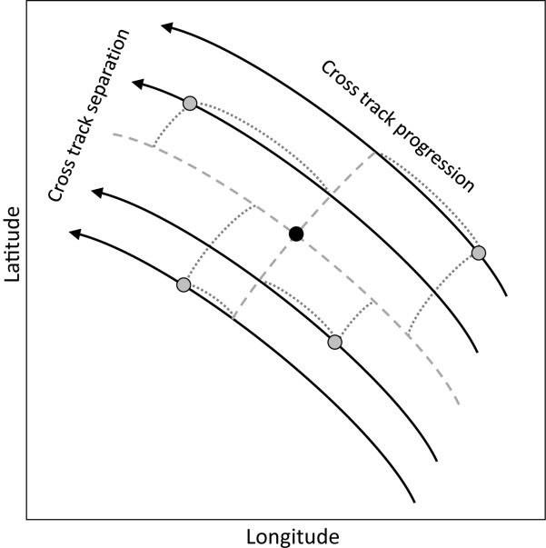

```{r setup, include=FALSE}
knitr::opts_chunk$set(echo = TRUE)
```

# Introduction

## Aim

1. Do hummingbirds vary their route among years and between seasons (initial results from @supp2015, but we can provide brief updated analysis). 
2. What are the environmental drivers of these differences (new stuff)
3. What are the environmental drivers of the routes (e.g. can we predict, not sure about this, see below)

# Methods

## Data

eBird data for 2006--2018 for the 5 hummingbird species from [@supp2015]. 

[auk R package](https://cornelllabofornithology.github.io/auk/) for getting records (NB the EBD needs to be downloaded to the local machine to use this).

Make sure we follow the relevant parts of [eBird best practices](http://strimas.com/ebird-best-practices/).

### eBird data preparation
For each species, we used the `auk` package to select "Stationary", "Traveling", and "Incidental" eBird records, from 1 Janurary 2008 to 31 December 2018. Some records are part of a group identifier (a group of >1 people recorded birds together), and to account for potential errors in recording bird location (latitude and longitude), we used `read_ebd(unique=FALSE)` to read in all records from a group, instead of just the one with the smallest sampleID. We then grouped all records by common_name, observation_date, and group_identifier, and calculated the mean latitude and longitude to use as the values going forward (latitude2, longitude2). Such discrepancies account for a relatively small proportion of the total number of records (*e.g. for Calliope hummingibrd, ~0.19% of all records*) but we felt it was safest to account for potential errors in this way. After the mean value for location was calculated, we kept only unique sampling identifiers, meaning that only a single record from each group was retained. We created new columns isolating, year, month, and julian day of the year for each record.


## Migration routes

We can follow methods from @lasortefranka.2016 to gain population level migration tracks with daily population centroids. This approach uses bootstrapping to get a measure of precision in the track, which may be useful. 

## Route flexibility

We can use the two measures from @lasorte2017

- cross-track progression (CTP): measures flexibility in progression along the route among years (can also do for seasons)
- cross-track separation (CTS): measures the geographic separation among years (also seasons)



Here, the grey points are yearly population centroids for each year, the black dot is the mean centroid across years. 

## Analysis 

### Drivers of route flexibility

I suggest that we fit models with the CTP and CTS as response variables. In both cases we can use environmental covariates (e.g. EVI, Temperature, Elevation), along with random effects (season & species: random slope and intercept; day: random intercept). We could also somehow incorporate the uncertainty/precision from the centroid calculation (this will either mean taking a meta-analysis or Bayesian approach - to discuss). 

The environmental covariates will be differences, rather than absolute values: 

$E_{diff} = E_y - E_{ny}$

Where $E_y$ is the value of the environmental variable for the population centroid location for that day/year; and $E_{ny}$ is the value of the environmental variable for the null population centroid location (e.g. the mean across years) for that day/year. 

We expect that if an environmental variable is important in the species adjusting it's route, that it will be important in the model. I recommend that rather than use a model selection approach (as before) we use a commonality approach, which will let us examine the importance of each variable [@ray-mukherjee2014]. 

### Drivers of migration

I'm not sure about this one. So the above tells us how important a variable is for a species route tracking, but not what the relationship looks like. We could do an additional analysis where we fit day as response, then use a model with the environmental variables (plus lat/long to get the effect once these are controlled for). We can then use the commonality approach to get the unique variance/deviance explained by each variable. This approach is robust to multicollinearity. 

# Results

# Discussion
# References
